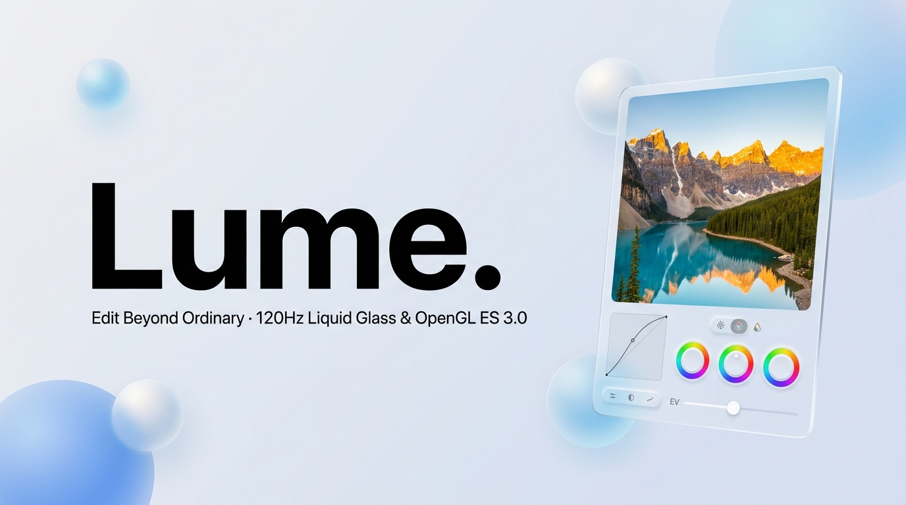

  

   
   

  <h1>Lume.</h1>
  
<strong>Edit Beyond Ordinary — Offline-First 120Hz Liquid Glass &amp; Neomorphic Pro Photo Studio for Android</strong>

  

    
    
    
    
    
  

---

## ✦ Overview

**Lume.** is a studio-grade, non-destructive Android photo editor engineered to feel like precision physical camera hardware. It combines a real-time **OpenGL ES 3.0 shader pipeline** and **OKLab perceptual color science** with a tactile **Soft Neomorphic** and **120Hz iOS-inspired Liquid Glass** interface.

Zero accounts. Zero cloud uploads. Zero watermarks or subscriptions—every edit happens locally on your GPU.

---

## ✨ Key Highlights

- **120Hz Liquid Glass & Neomorphic Themes**: Switch seamlessly between *Liquid Glass*, *Light Neomorphic*, and *Dark Studio* themes with physical spring animations.
- **Real-Time OpenGL ES 3.0 Pipeline**: Linear-light Exposure, Highlight Recovery, PCHIP monotone cubic RGB curves, 8-band OKLab HSL mixer, and 3-way Color Grading wheels.
- **Selective Masking & Retouch**: Up to 8 non-destructive Linear, Radial, and Brush masks with local tone overrides, plus patch-match Heal and Clone stamps.
- **100% Offline & Private**: Atomic auto-save, 50-step coalesced undo history, and full-resolution JPEG, PNG, and WebP export.

---

## 📲 Direct APK Download

- **[Click here to download `Lume.apk` (v1.0.0 · 4.9 MB)](./Lume.apk)**
- Or visit the live Vercel promotional site hosted from this repository to try the interactive browser preview and scan the QR code on your phone.

---

  Crafted with precision · <strong>Lume.</strong> Edit Beyond Ordinary

